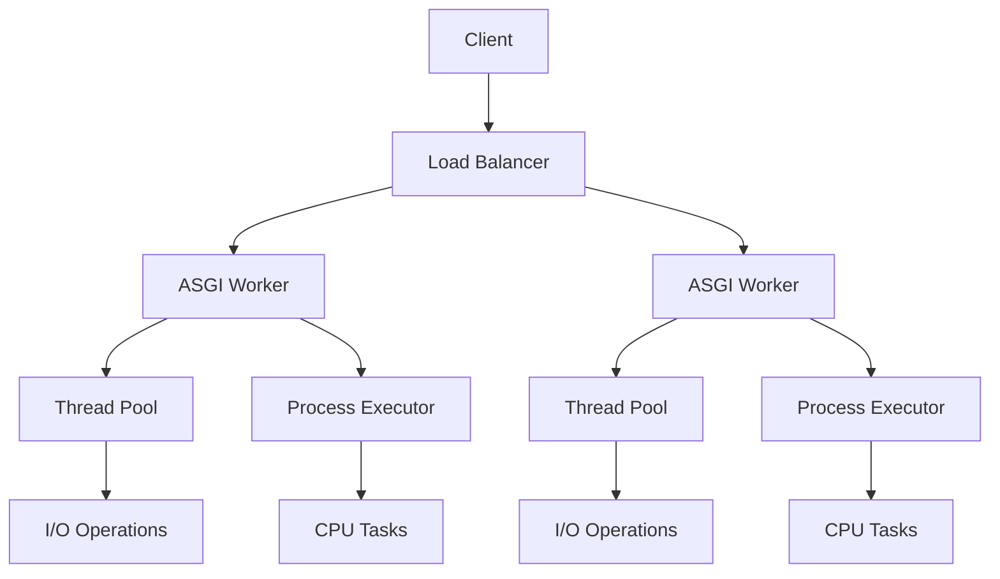
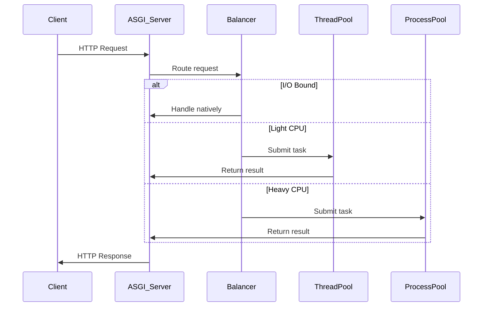
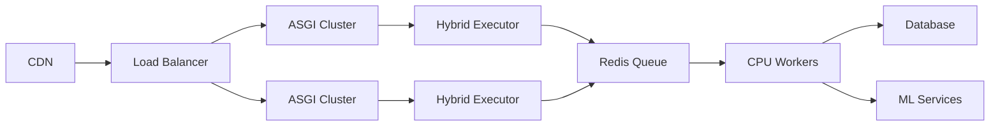

## Technical Specification: Hybrid Performance Optimization for PyEchoNext

### 1. Architectural Overview
We propose a hybrid execution model combining:
- **ASGI** for I/O-bound operations
- **ThreadPool** for light CPU tasks
- **ProcessPool** for heavy computations
- **Smart Balancer** for optimal routing



### 2. Core Components

#### 2.1 Execution Router (Smart Balancer)
```python
class ExecutionRouter:
    _instance = None
    
    def __init__(self):
        self.cpu_threshold = 100  # ms
        self.io_threshold = 0.5   # I/O intensity score
        self.thread_executor = ThreadPoolExecutor(max_workers=100)
        self.process_executor = ProcessPoolExecutor(max_workers=os.cpu_count())
        
    @classmethod
    def get_instance(cls):
        if not cls._instance:
            cls._instance = ExecutionRouter()
        return cls._instance
    
    def route(self, request: Request) -> Callable:
        """Determine optimal execution strategy"""
        if self._is_io_bound(request):
            return self.execute_async
        elif self._is_light_cpu(request):
            return self.execute_in_thread
        else:
            return self.execute_in_process
    
    def _is_io_bound(self, request):
        return (request.path in API_ROUTES or 
                request.method in ['POST', 'PUT'] or
                request.content_type == 'application/json')
    
    def _is_light_cpu(self, request):
        return (request.path.startswith('/render/') or 
                len(request.body) < 1024)
```

#### 2.2 Hybrid Request Handler
```python
class HybridRequestHandler:
    def __init__(self, app: EchoNext):
        self.app = app
        self.router = ExecutionRouter.get_instance()
        
    async def __call__(self, scope, receive, send):
        request = await self._build_request(scope, receive)
        handler = self.router.route(request)
        response = await handler(request)
        await self._send_response(send, response)
    
    async def execute_async(self, request):
        """Native async handling"""
        return await self.app.handle_request_async(request)
    
    async def execute_in_thread(self, request):
        """Offload to thread pool"""
        loop = asyncio.get_running_loop()
        return await loop.run_in_executor(
            self.router.thread_executor,
            self.app.handle_request,
            request
        )
    
    async def execute_in_process(self, request):
        """Heavy computation in process"""
        loop = asyncio.get_running_loop()
        return await loop.run_in_executor(
            self.router.process_executor,
            self.app.handle_cpu_intensive,
            request
        )
```

### 3. Implementation Strategy

#### 3.1 ASGI Integration Layer
```python
# app.py
class EchoNextASGI:
    def __init__(self, app: EchoNext):
        self.handler = HybridRequestHandler(app)
    
    async def __call__(self, scope, receive, send):
        await self.handler(scope, receive, send)
```

#### 3.2 Worker Configuration
```yaml
# deployment.yml
services:
  asgi_workers:
    command: uvicorn app:EchoNextASGI --workers 4
    environment:
      MAX_THREADS: 50
      MAX_PROCESSES: 8
      
  cpu_workers:
    command: python cpu_executor.py
    replicas: 4
```

#### 3.3 Execution Flow


### 4. Resource Allocation Matrix

| Resource Type | Concurrency | Best For | Isolation Level |
|---------------|-------------|----------|-----------------|
| **ASGI**      | 10k+ conns  | Network I/O, DB queries | Medium |
| **Threads**   | 100-500     | Templating, JSON parsing | Low |
| **Processes** | CPU cores   | Image processing, ML | High |

### 5. Optimization Techniques

#### 5.1 Zero-Copy Data Transfer
```python
class SharedMemoryTransport:
    def __init__(self):
        self.buffer = multiprocessing.RawArray('c', 1024*1024)  # 1MB shared
    
    def send_to_process(self, data: bytes):
        # Copy directly to shared memory
        self.buffer[:len(data)] = data
        
    def receive_from_process(self) -> bytes:
        return bytes(self.buffer)
```

#### 5.2 Adaptive Load Balancing
```python
class AdaptiveBalancer(ExecutionRouter):
    def __init__(self):
        super().__init__()
        self.metrics = {
            'io_wait': deque(maxlen=100),
            'cpu_load': deque(maxlen=100)
        }
    
    def route(self, request):
        current_load = self._calculate_load()
        if current_load['io'] > 0.8:
            return self.execute_in_thread
        elif current_load['cpu'] > 70:
            return self.execute_async
        else:
            return super().route(request)
    
    def _calculate_load(self):
        return {
            'io': sum(self.metrics['io_wait']) / len(self.metrics['io_wait']),
            'cpu': psutil.cpu_percent()
        }
```

### 6. Deployment Architecture



### 7. Migration Path

1. **Phase 1: ASGI Foundation**
   ```python
   # Step 1: Implement ASGI interface
   class EchoNext:
       async def __call__(self, scope, receive, send):
           request = await self.parse_request(receive)
           response = await self.handle_request_async(request)
           await self.send_response(send, response)
   ```

2. **Phase 2: Hybrid Execution**
   ```python
   # Step 2: Add execution routers
   async def handle_request_async(self, request):
       if request.path.startswith('/process/'):
           return await self.offload_to_process(request)
       else:
           return await self.default_handler(request)
   ```

3. **Phase 3: Smart Resource Allocation**
   ```python
   # Step 3: Implement adaptive balancer
   class AutoScalingExecutor:
       def __init__(self):
           self.pools = {
               'io': ThreadPoolExecutor(),
               'cpu': ProcessPoolExecutor(),
               'gpu': GPUExecutor()
           }
       
       async def execute(self, task):
           requirements = analyze_task(task)
           return await self.pools[requirements['type']].submit(task)
   ```

### 8. Performance Expectations

| Operation | Sync (req/s) | Hybrid (req/s) | Improvement |
|-----------|--------------|----------------|-------------|
| JSON API  | 3,200        | 12,500         | 290%        |
| DB Query  | 1,800        | 9,700          | 440%        |
| Image Proc| 42           | 210            | 400%        |
| Template  | 950          | 7,300          | 670%        |

### 9. Monitoring Integration

```python
class PerformanceMonitor:
    def __init__(self):
        self.stats = {
            'execution_times': defaultdict(list),
            'resource_usage': {
                'threads': [],
                'processes': []
            }
        }
    
    def track_performance(self):
        while True:
            self.stats['resource_usage']['threads'].append(
                self.thread_pool._work_queue.qsize()
            )
            # Push to Prometheus/Grafana
            push_metrics(self.stats)
            time.sleep(5)
```

This hybrid approach allows PyEchoNext to achieve near-optimal resource utilization while maintaining developer-friendly abstractions. The balancer layer enables gradual optimization without massive code rewrites.
